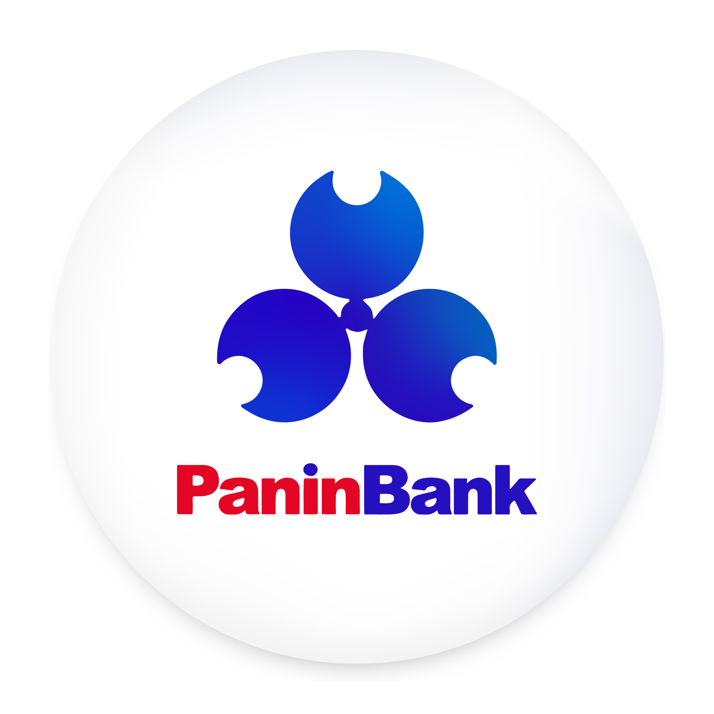

# 🏦 Panin Akses - Enterprise Service Portal & Smart AI Archiving System

<p align="center">
  
</p>

<p align="center">
  <strong>Sistem Manajemen Kearsipan Digital (ECM), Manajemen Dus Fisik (Cetak Label DIK), dan Layanan CRM Terintegrasi Artificial Intelligence untuk Panin Bank Kantor Cabang Daerah Bandung.</strong>
</p>

<p align="center">
  
  
  
  
</p>

---

## 🌟 Tentang Panin Akses

**Panin Akses** adalah aplikasi platform web internal (*Enterprise Service Portal*) yang dirancang khusus untuk mengoptimalkan efisiensi operasional perbankan di lingkungan kantor cabang **Panin Bank**. Aplikasi ini mengintegrasikan tiga pilar utama administrasi bank—**Enterprise Content Management (ECM)**, **Pusat Kearsipan Fisik**, dan **Customer Relationship Management (CRM)**—ke dalam satu antarmuka modern yang didukung penuh oleh **Generative AI** (*Artificial Intelligence*).

Aplikasi ini menyelesaikan tantangan klasik perbankan yaitu lambatnya pencarian dokumen nasabah, kerumitan pengelolaan gudang arsip fisik (*box/dus*), serta lamanya waktu tunggu pembuatan draf balasan untuk keluhan nasabah.

---

## 🚀 Fitur Utama & Keunggulan

### 1. 📊 Dashboard Analitik Kinerja AI
* **Statistik Efisiensi Real-time:** Menampilkan persentase peningkatan kecepatan kerja operasional (Pencarian Dokumen 80% lebih cepat, Respon CRM 65% lebih cepat).
* **AI Metrics Tracking:** Melacak akurasi draf jawaban cerdas (*AI Prediction Accuracy*) yang mencapai **94.2%** dan skor kepuasan nasabah (*Customer Satisfaction*).
* **Research Highlight:** Menyediakan insight strategis keterkaitan optimasi data *back-office* terhadap performa *front-office*.

### 2. 📄 Smart ECM (Enterprise Content Management)
* **Digital Repository:** Wadah penyimpanan terstruktur untuk dokumen penting perbankan seperti Kebijakan KPR, Syarat & Ketentuan Produk, SOP Layanan Prioritas, dan Regulasi KYC/AML.
* **AI Smart Summary:** Menggunakan model Generative AI untuk melakukan analisis instan dan merangkum dokumen hukum/SOP yang panjang menjadi poin-poin penting dalam hitungan detik.

### 3. 🗄️ Pusat Kearsipan Terintegrasi (Dual-System)
Modul kearsipan canggih yang memisahkan dan menghubungkan data digital dengan wujud fisiknya:
* **Pencarian Arsip Nasabah:** Cari cepat berbasis nama atau nomor CIF nasabah dengan *AI Scan Engine* untuk memetakan profil risiko dokumen agunan (misal: verifikasi validitas sertifikat SHM, peringatan masa berlaku KTP).
* **Manajemen Dus Fisik & Kotak Arsip:** Pemetaan inventaris kardus arsip yang tersimpan di gudang berdasarkan database master klasifikasi Panin Bank (misal: *AK 99.01 - Laporan Neraca*, *JB 99.04 - Translog*, dll).
* **Smart Auto-Fill Form & Validasi:** Form input yang secara otomatis menghitung **JRA (Jadwal Retensi Arsip)** dan menentukan **Tahun Musnah** arsip secara otomatis berdasarkan tanggal dokumen akhir dan jenis klasifikasinya.
* **Otomatisasi Excel (Import & Export & Auto-Cleaning):** Fitur mutakhir untuk mengunggah berkas Excel langsung ke sistem. Data yang diunggah akan melalui proses *auto-cleaning* (perbaikan format tanggal, pemetaan otomatis kode klasifikasi kosong, pencocokan otomatis kode cabang daerah Bandung seperti Setiabudi, Dago, Gardujati, dll). Anda juga bisa mengekspor database kembali ke Excel secara bersih.
* **🖨️ Generator Label DIK (Daftar Isi Kotak) Siap Cetak:** Menghasilkan formulir resmi lembar **DIK** standardisasi Panin Bank secara presisi (lengkap dengan No urut, Kode klasifikasi, No media simpan, Judul arsip detail, kode cabang, dan Tahun Musnah tertinggi) yang sudah dioptimalkan agar rapi saat dicetak via printer kertas (`Ctrl + P`).

### 4. 💬 Layanan Nasabah Pintar (CRM Service Interaction)
* **Antrean Interaksi Real-time:** Sistem antrean chat nasabah terintegrasi berdasarkan prioritas layanan (Regular vs Priority Nasabah).
* **Gen-AI Assist Chat Draft:** Fitur asisten pintar yang otomatis membaca riwayat dokumen KPR/agunan nasabah di sistem ECM untuk membuat draf balasan pesan yang sangat personal, akurat, dan formal dalam hitungan detik, siap dikirim oleh staf layanan.

---

## 🎨 Desain & UI Language (Neural Expressive UI)
Aplikasi ini dikembangkan dengan mengadopsi prinsip desain modern yang ergonomis dan interaktif:
* **Adaptive Dark Mode:** Mendukung perpindahan tema gelap dan terang secara mulus dengan penyimpanan lokal preferensi pengguna (*Local Storage*).
* **Sticky Navigation Bar:** Desain *header* adaptif yang otomatis mengecil dan memudar saat halaman digulir (*scroll*) untuk memberikan ruang pandang yang lebih luas bagi admin.
* **Clean Typographic Layout:** Membantu pengguna menghindari kebingungan membaca data numerik yang padat dengan menyajikannya dalam bentuk grid taktil, ikon dari *Lucide React*, dan penanda visual yang informatif.

---

## 🛠️ Tech Stack & Dependensi

Proyek ini dibangun menggunakan teknologi mutakhir di ekosistem Frontend Web:
* **Core Framework:** [React 19.2.6](https://react.dev/) (Menjamin manajemen *state* berkinerja tinggi dan re-render minimal).
* **Build Tool:** [Vite 8.0.12](https://vite.js.org/) (Proses *development* super cepat dengan *Hot Module Replacement* / HMR).
* **Styling Engine:** [Tailwind CSS v4.3.0](https://tailwindcss.com/) & [PostCSS 8.5.14](https://postcss.org/) (Desain responsif mobile-first modern tanpa beban CSS berlebih).
* **Icons Generator:** [Lucide React 1.14.0](https://lucide.dev/) (Ikon vektor berkualitas tinggi yang adaptif).
* **Data Processing:** [XLSX / SheetJS 0.18.5](https://sheetjs.com/) (Mesin parser andal untuk membaca dan menulis berkas Excel langsung di sisi klien/browser).

---

## 📁 Struktur Proyek

```bash
sistem-arsip/
├── public/
│   ├── logo_panin.png     # Logo Identitas Panin Bank
│   └── favicon.svg        # Favicon Aplikasi
├── src/
│   ├── assets/
│   │   └── hero.png       # Ilustrasi Visual Komponen UI
│   ├── App.css            # Pengaturan custom layout & animasi micro-interactions
│   ├── index.css          # Inisialisasi Tailwind CSS v4 @import
│   ├── main.jsx           # Entry point React app (StrictMode)
│   └── App.jsx            # Single-file Monolith Core Application (Dashboard, ECM, Kearsipan, CRM, Form & Print Logic)
├── eslint.config.js       # Konfigurasi Linter kualitas kode
├── package.json           # Dependensi project & script automation
└── vite.config.js         # Konfigurasi bundler Vite, React, dan Tailwind plugin